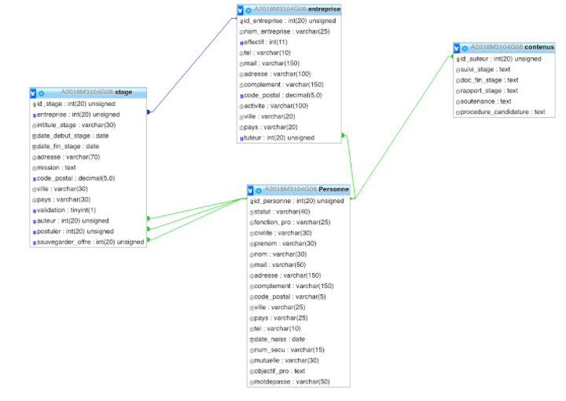
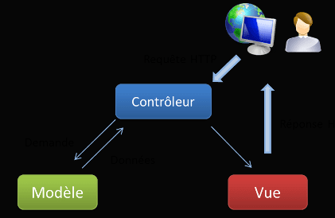

# Documentation projet Stage finder
## description générale du site
Le site web concernant cette documentation a été programmé dans le cadre du projet PHP du module M3104. Le site a pour principale vocation la gestion et le suivi des stages des étudiants. Actuellement, ce processus demande énormement de temps, le but étant de faciliter tout ça.

Le site se presente d'abord avec une page d'accueil ou nous retrouvons un espace de connection, mais aussi toutes les informations relatives aux stages comme :

La procedure de candidature
Le suivi du stage
Les documents à rendre à la fin du stage
Le rapport de stage
La soutenance
Le site propose alors de se connecter, soit en tant qu'étudiant, responsable, professionnel, secretariat ou administrateur.

Selon le statut choisit, nous avons acces à differentes options :

<u> Etudiant : </u>
- Offres de stage
- Mon profil
- Demande de validation de stage
- Se déconnecter

<u> Responsable : </u>
- Offres de stage
- Mon profil
- Offres de stage
- Validation de stages
- Gestion des contenus
- Se déconnecter

<u> Professionnel : </u>
- Offres de stage
- Mon profil
- Offres de stage
- Se déconnecter

<u> Administrateur : </u>
- Offres de stage
- Mon profil
- Offres de stage
- Validation de stage
- Gestion des utilisateurs
- Edition des conventions
- Gestion des contenus
- Se déconnecter

### <u> Schéma de données </u>
Le diagramme de classe de la base de données est le suivant :

### <u> Architecture </u>
L'architecture utilisée suit le modèle MVC,qui est un motif d'architecture logicielle destiné aux interfaces graphiques lancé en 1978 et très populaire pour les applications web. Le motif est composé de trois types de modules ayant trois responsabilités différentes : les modèles, les vues et les contrôleurs.

Un modèle (Model) contient les données à afficher.
Une vue (View) contient la présentation de l'interface graphique.
Un contrôleur (Controller) contient la logique concernant les actions effectuées par l'utilisateur.

<u> Fichiers utilisés : </u>

Contrôleur : main_stage.php \
Modèle : mStages.php \
Vues : 36 fichiers + 1 dossier

Pour effectuer cette architecture le framework Codeigniter a été utilisé.

### <u> Procédure d'installation sur un hébergement </u>
Logiciels indispensables :
- Un navigateur Web
- Un client FTP (logiciel servant à transférer des fichiers par Internet par le protocole FTP)
- Un éditeur de texte

Nous supposerons dans la suite de cette page que votre hébergement utilise les logiciels suivants :
- Le serveur Web Apache (logiciel qui distribue les pages Web)
- Le langage PHP (logiciel qui construit le contenu des pages Web dynamiques)
- La base de données phpmyadmin

Votre hébergeur doit vous fournir :
- le nom du serveur FTP (du type ftp.monsite.fr),
- le nom d'utilisateur,
- le mot de passe.

Nous avons utilisé filezilla apres connection sftp pour transferer l'intégralité de notre site web, nous avons du modifier certains reglages notamment d'architecture car le site ne fonctionnait pas pareil qu'en local, une fois les problemes résolus, le site était parfaitement fonctionnel en ligne.
Les réglages concernaient les fichiers de configuration de Codigniter tels que "database.php" et "config.php" dans le répertoire "application/config".

Le code rendu se trouve dans le répertoire "Rendu_2eme_annee_DUT". \
La note finale a été de 17/20. \
Les tests on été réalisés avec l'outil Uwampp (base de données PHPmyadmin et serveur Apache).

## Version du projet utilisant Docker
La nouvelle version sur ce dépot dans le dossier Projet_PHP utilise des conteneur Docker pour faire fonctionner le site avec une architecture en microservice.
Il y a 2 microservices :
- myapp
- mysql

Le service myapp gère le serveur qui héberge le site et le service mysql gère la base de données.

### <u> Installation et lancement </u>
Les outils requis pour mettre en place cette version du site sont les suivants :
- une connexion à internet
- Docker

Pour installer et lancer les services il faut effectuer les actions suivantes :
- télécharger le dossier du dépôt et le mettre dans un emplacement au choix
- ouvrir un shell dans le dossier où se trouve le fichier "docker-compose.yml"
- taper et lancer la commande "docker-compose up"

Le site devrait être accessible à l'adresse http://localhost:8000 

Pour revenir à l'état initial de la base de données défini par le script "stages_projet.sql" il suffit de lancer la commande "docker-compose down" 
puis d'utiliser la commande "docker-compose up".

### <u> Comptes disponibles sur le site </u>
Les comptes d'administrateur: 
- email : admin@gmail.com | mot de passe :  motdepasse

Les comptes d'étudiant :
- email : etu@gmail.com | mot de passe :  etudiant

Le compte de professionnel :
- email : mailpro@gmail.com | mot de passe :  mdppro

Le compte de responsable des stage :
- email : mailres@gmail.com | mot de passe :  mdpresp

# Credits
Concepteurs du site web :
- Collado Lucas
- Masselot Nicolas